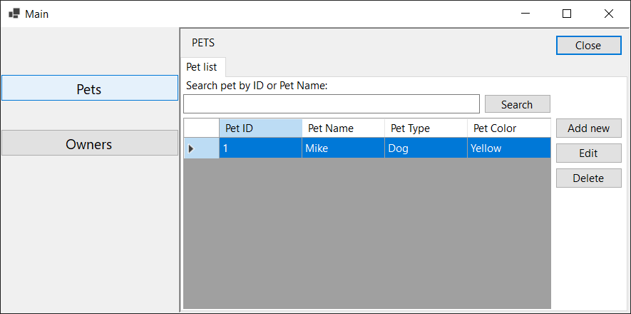
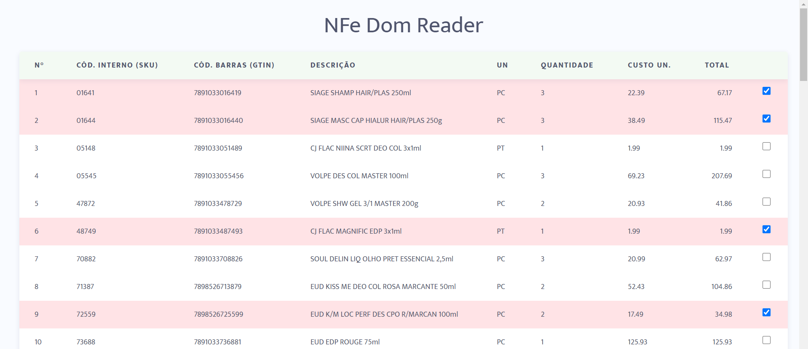
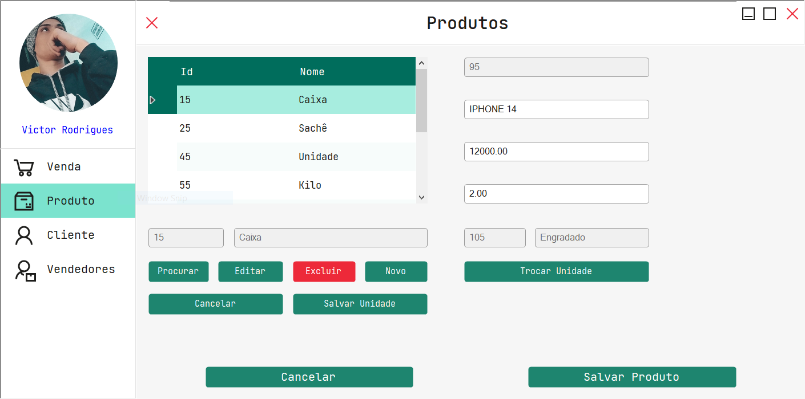

Look in: [English](/README_en.md) | Português

<h1> Quem sou... </h1>

Programador.

 

 
  <b> 
    <a href="https://github.com/src-rodrigues/veterinary-mvp-pattern" target="_blank">Veterinay MVP Pattern</a>
  </b>

Sistema feito em formulários windows, com banco de dados em MySQL, para gerenciar um petshop, onde é possível cadastrar clientes, animais, serviços, funcionários, fornecedores, e realizar vendas, com emissão de nota fiscal, e relatórios.

 👈🏽 <i> Clique aqui para para ver mais detalhes </i> 

   
  

    
  

 

 <b> <a href="https://github.com/src-rodrigues/nfe-dom-reader">NFe Dom Reader</a> </b> 

Site estático feito em Javascript puro, para ler arquivos XML de notas fiscais eletrônicas, e exibir os dados em uma tabela.

 👈🏽 Clique aqui para para ver mais detalhes 

   
  

    
  

 

 <b> <a href="https://github.com/src-rodrigues/ether-gestor-sys">Ether Gestor Sys</a> </b> 

Ether Gestor Sys é um sistema de gestão de estoque, feito em Windows Forms com C#, e banco de dados em MySQL, onde é possível cadastrar produtos, fornecedores, clientes, e realizar vendas, com emissão de nota fiscal, e relatórios, com API .NET via DLL integrada na aplicação.

 👈🏽 Clique aqui para para ver mais detalhes 

   
  

    
  

 

 <b> <a href="https://github.com/src-rodrigues/calculadora-de-boteco">Calculadora de Boteco</a> </b> 

Calculadora de Boteco, é uma aplicação front-end, react, que tem como objetivo calcular o valor de uma conta de um boteco.

 👈🏽 Clique aqui para para ver mais detalhes 

   
  

    
  

